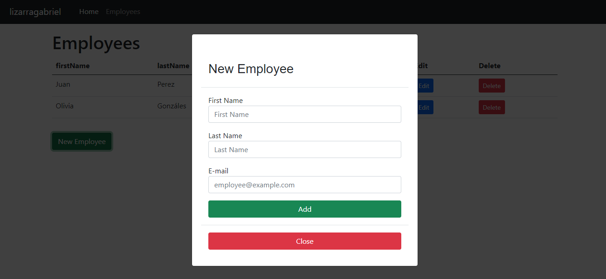

# MongoDB-Node CRUD

Employees CRUD

https://lizanodejs.herokuapp.com/

<h2>Tools</h2>
<ul>
    <li>NodeJS</li>
    <li>MongoDB</li>
    <li>JavaScript</li>
    <li>Bootstrap</li>
    <li>EJS</li>
</ul>

Screen

