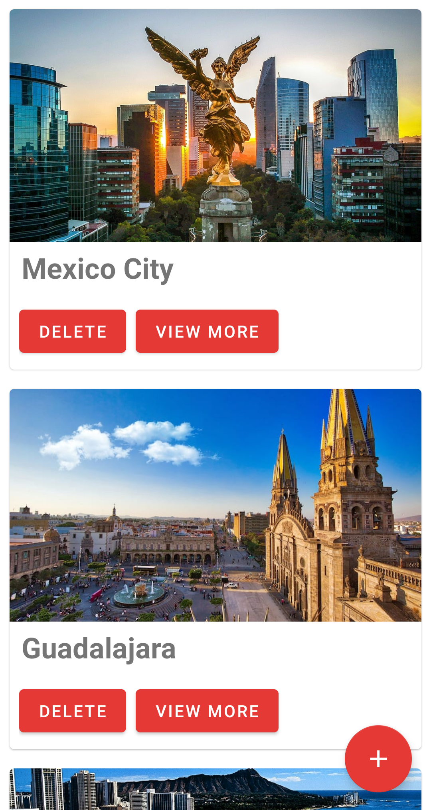
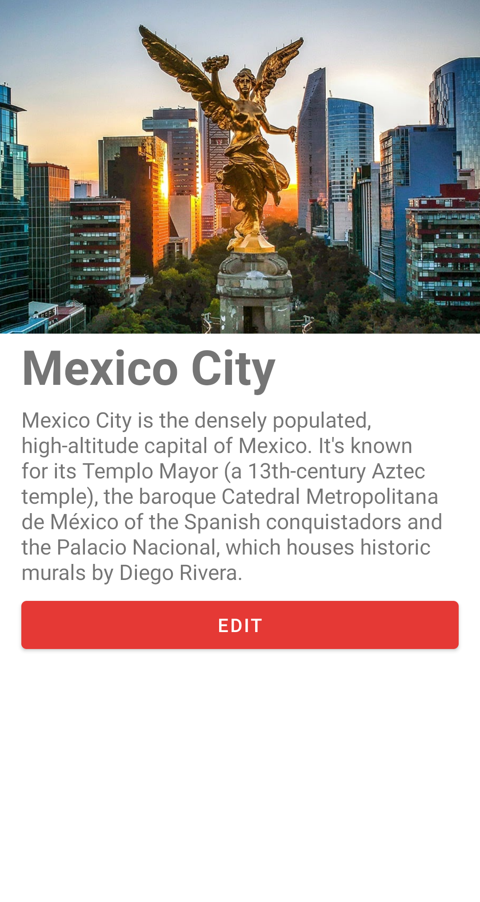
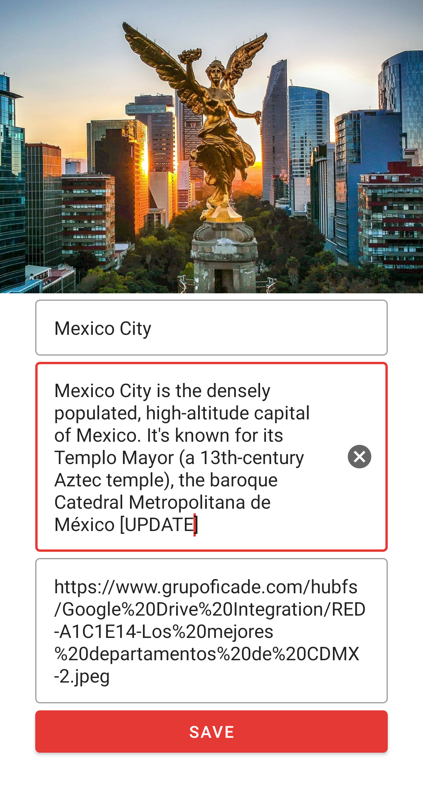
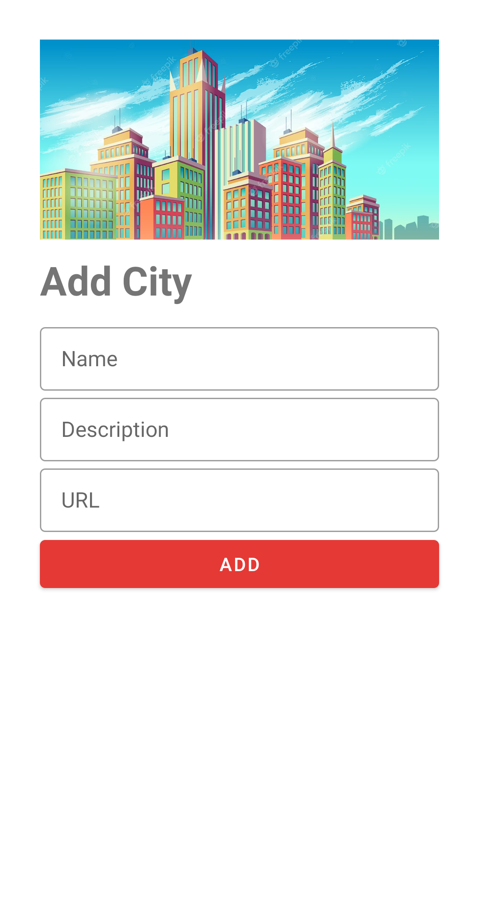
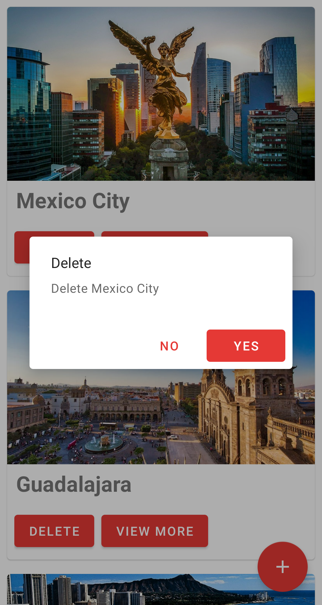
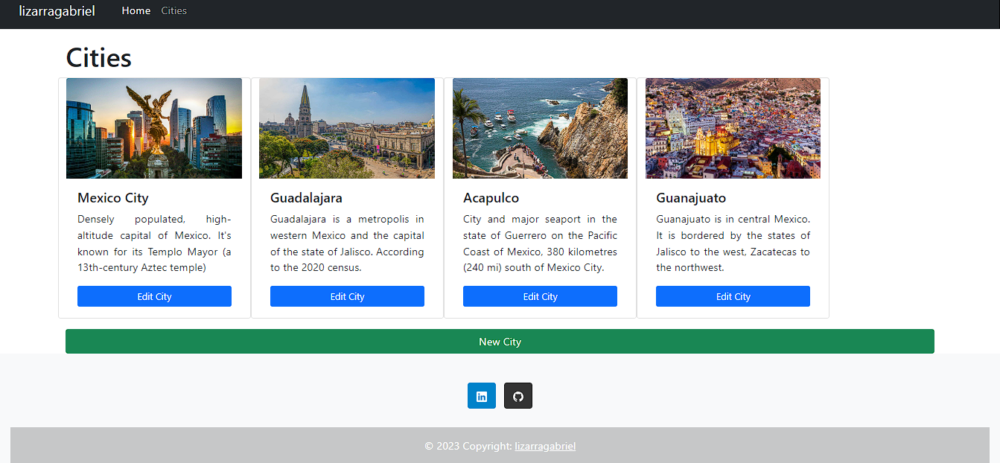
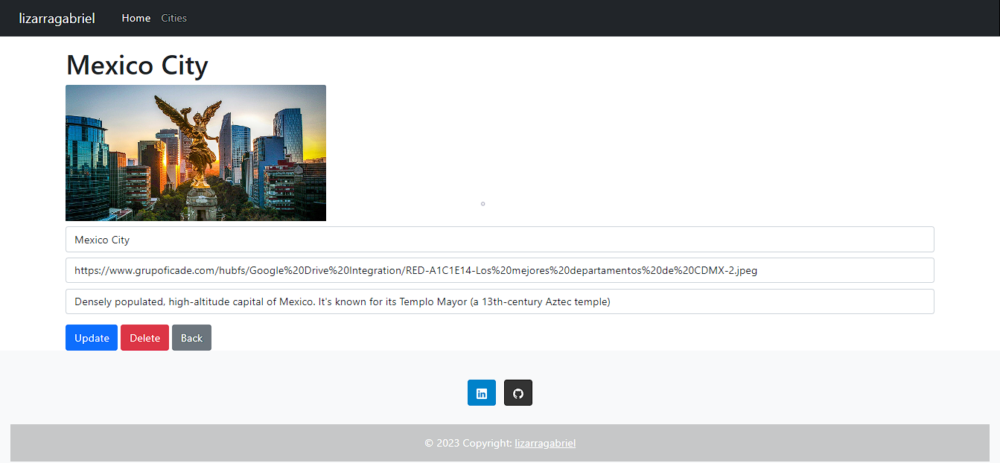
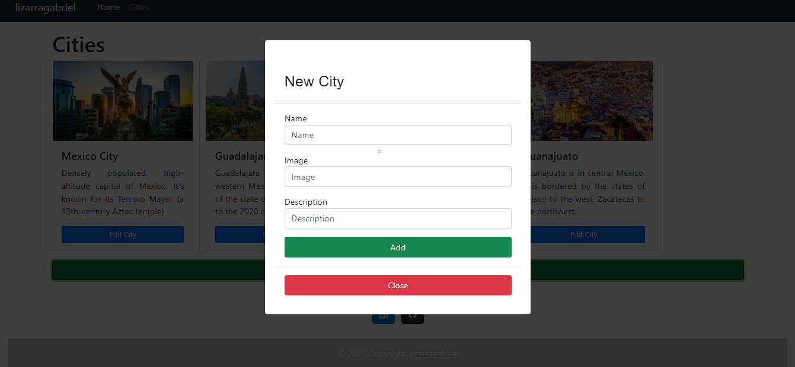
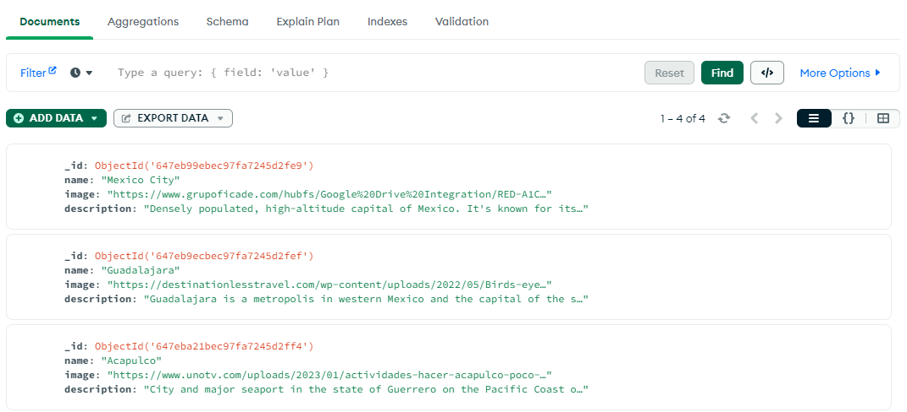

# CityMaz

## Description


Android application programmed in Kotlin language with MVVM architecture. Provide information from a **local API** development with back end in Node.js using Retrofit and Dependency Injection with Dagger/Hilt. User can add new cities in México, show a list of cities of México, update existing city, delete a specific city or the entire list.Design guides with Material Design. It also works as a web application


## Features

* Show list of the most important cities in Mexico
* Show details of a specific city
* Add a city in Mexico
* Update an existing city in Mexico
* Delete a city in México

## Technologies

* Java
* Dagger/Hilt
* Data Binding
* MVVM
* Glide
* Retrofit
* LiveData
* ViewModel
* Node.js
* Javascript
* Material Design
* Navigation Component

## Instalation

1. Clone this repository

```
    git clone https://github.com/lizarragabriel/CityMaz.git
```

## Screens

### Android Application

<table>
    <tr>
        <td></td>
        <td></td>
        <td></td>
        <td></td>    
        <td></td>        
    </tr>
</table>

### Web Application

#### Home Screen



#### Edit Screen



#### Add Screen



### MongoDB


